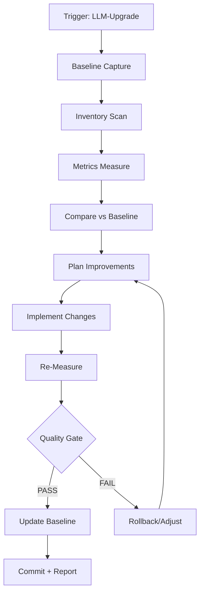

# Evolution Workflow

## Vollständiger Zyklus



## Step Details

### 1. Baseline Capture

```bash
# Speichere aktuelle Metriken als Baseline
cp project-metrics/metrics.json project-metrics/baseline.json
git add project-metrics/baseline.json
git commit -m "[evolve] Set baseline for LLM-[Version]"
```

### 2. Inventory Scan

```bash
# Struktur analysieren
fd -e ts -e tsx --exclude node_modules > /tmp/inventory.txt
fd SKILL.md .agent/skills > /tmp/skills.txt

# Stats
echo "Files: $(wc -l < /tmp/inventory.txt)"
echo "Skills: $(wc -l < /tmp/skills.txt)"
```

### 3. Metrics Measure

```bash
# Vollständige Messung (siehe metrics-registry.md)
pnpm lint 2>&1 | tee /tmp/lint.log
pnpm test --coverage 2>&1 | tee /tmp/test.log
pnpm audit --json > /tmp/audit.json
```

### 4. Compare & Prioritize

Priorisiere Verbesserungen nach:
1. Security (critical_cves = 0)
2. Code Quality (lint_errors < 10)
3. Test Coverage (> 80%)
4. Documentation (readme_coverage)
5. Agent-Readiness (skill_compliance = 100%)

### 5. Implement (Max 5 Tasks pro Cycle)

| Task Type | Max Changes | Risk |
|-----------|-------------|------|
| Fix lint error | 10 files | low |
| Add test | 3 files | low |
| Refactor hotspot | 1 file | medium |
| Update docs | 5 files | low |
| Security patch | 1 dep | medium |

### 6. Quality Gate Criteria

```
PASS wenn:
  - critical_cves = 0
  - lint_errors nicht gestiegen
  - test_coverage nicht gesunken
  - (score_delta > 0 ODER 2+ Metriken verbessert)

FAIL wenn:
  - critical_cves > 0
  - test_coverage gesunken > 5%
  - lint_errors verdoppelt
```

### 7. Commit Convention

```
[evolve] LLM-[Version]: +[delta]% Score

- Structure: 82 → 85 (+3)
- Code: 75 → 80 (+5)
- Docs: 70 → 72 (+2)

Refs: #evolution-[timestamp]
```

## Cycle Limits

| Parameter | Value |
|-----------|-------|
| Max Cycles pro LLM-Gen | 3 |
| Stop bei Score | > 95 |
| Stop bei Delta | < 1% |
| Rollback Threshold | Delta < -5% |
