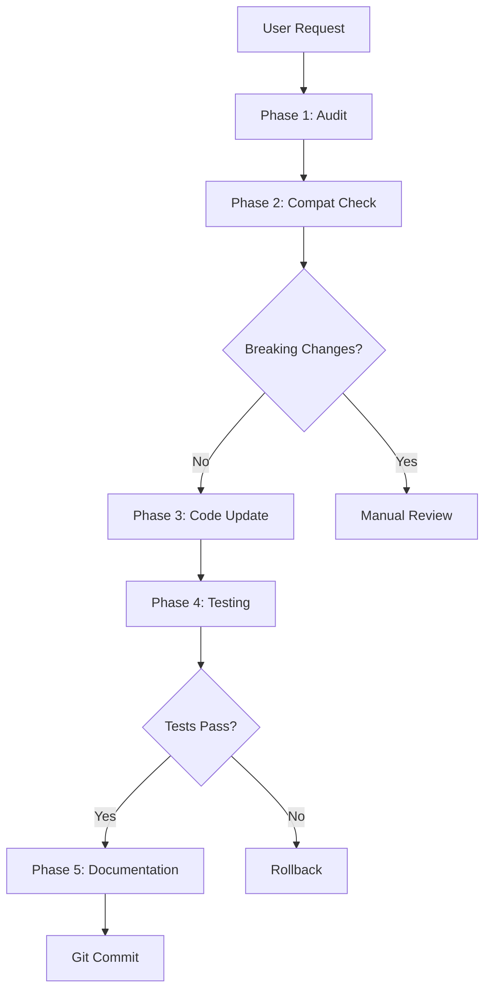

# Component Updater Skill

Automatisiertes Komponenten-Management für das obsidian-nextcloud-platform Projekt.

## Features

- 🔍 **Automatisches Audit** - Scannt alle Dependencies
- 🌐 **Web-Recherche** - Verifiziert Versionen online
- 🔀 **Kompatibilitäts-Check** - Matrix-basierte Analyse
- 🧪 **Agent Browser Testing** - UI-Regression-Tests
- 📊 **Dokumentation** - Audit-Trail mit COMPONENT_INVENTORY.md

## Quick Start

```
# 1. Audit starten
"Führe einen Component Audit mit Web-Recherche durch"

# 2. Spezifisches Update
"Update Prisma zur neuesten Version mit dem component-updater Skill"

# 3. Bulk Update
"Update alle P1-Komponenten gemäß COMPONENT_INVENTORY.md"
```

## Skill-Struktur

```
.antigravity/skills/component-updater/
├── skill.md                    # Hauptskill (5 Phasen)
├── README.md                   # Diese Datei
├── examples/
│   ├── QUICK_START.md         # 5-Minuten Setup
│   └── component-inventory-template.md
├── scripts/
│   └── audit-components.sh    # Automatisches Audit
└── references/
    └── COMPATIBILITY_MATRIX.md # Abhängigkeiten
```

## Typischer Workflow



## Priority Levels

| Level | Beschreibung | Zeitrahmen |
|-------|--------------|------------|
| P1 | Security, EOL | 24 Stunden |
| P2 | Major Features | Diese Woche |
| P3 | Minor Updates | Nächster Sprint |

## Komponenten im Projekt

| Kategorie | Komponenten |
|-----------|-------------|
| Runtime | Node.js 20+ |
| Backend | Fastify 5, Prisma 5 |
| Frontend | Next.js 16, React 19 |
| Queue | BullMQ 5, Redis 7 |
| Plugin | Obsidian API 1.8 |
| Dev | TypeScript 5.9, ESLint |

## Integration mit anderen Skills

- **web-researcher**: Für tiefe Recherche bei Breaking Changes
- **agent-browser-testing**: Für UI-Regression-Tests
- **prisma-database**: Für Schema-Migrationen

## Best Practices

1. **Montag-Audit**: Wöchentliches Audit am Montag
2. **Batch-Updates**: Ähnliche Deps zusammen updaten
3. **Branch-Strategy**: Ein Branch pro Update
4. **Test-First**: Nie ohne grüne Tests mergen

## Customization

### Neue Komponente hinzufügen

1. `COMPATIBILITY_MATRIX.md` aktualisieren
2. `component-inventory-template.md` erweitern
3. `audit-components.sh` anpassen (falls nötig)

### Priority anpassen

In `skill.md` die Priority-Kriterien modifizieren.

## Troubleshooting

| Problem | Lösung |
|---------|--------|
| Breaking Changes | COMPATIBILITY_MATRIX konsultieren |
| Build-Fehler | TypeScript Errors zuerst fixen |
| Test-Fehler | Selektoren in Page Objects prüfen |
| Rollback nötig | `git checkout main` |

## Links

- [skill.md](./skill.md) - Vollständiger Skill
- [QUICK_START.md](./examples/QUICK_START.md) - 5-Minuten Setup
- [COMPATIBILITY_MATRIX.md](./references/COMPATIBILITY_MATRIX.md) - Abhängigkeiten
