# Obsidian Nextcloud Media Platform

> Privacy-first media sync with offline Ed25519 licensing. Production-ready architecture bridging Obsidian, Nextcloud, and n8n automation.

## Quick Start

### 1. Clone and Install

```bash
git clone https://github.com/MasterofMakros/obsidian-nextcloud-platform.git
cd obsidian-nextcloud-platform
pnpm install
```

### 2. Start Infrastructure

```bash
docker compose up -d postgres redis
```

### 3. Start Development Services

Open four terminals:

```bash
# Terminal 1: API Server (Port 3011)
pnpm --filter api run dev

# Terminal 2: Worker (Port 9110)
pnpm --filter worker run dev

# Terminal 3: Gateway (Port 8081)
pnpm --filter gateway run dev

# Terminal 4: Web Frontend (Port 3010)
pnpm --filter web run dev
```

### 4. Open the App

Navigate to **http://localhost:3010**

> 💡 API docs: `http://localhost:3011/docs`

## Architecture

```mermaid
graph TB
    subgraph "Client Layer"
        Web["🌐 Next.js 14<br/>Port 3010"]
        Plugin["📓 Obsidian Plugin<br/>(Offline ED25519)"]
    end

    subgraph "Automation Layer"
        N8N["⚡ n8n<br/>Workflow Engine"]
    end

    subgraph "API Layer"
        Gateway["🤖 AI Gateway<br/>Port 8081"]
        API["🔌 Fastify API<br/>Port 3011"]
    end

    subgraph "Processing Layer"
        Worker["⚙️ BullMQ Worker<br/>Port 9110"]
    end

    subgraph "Data Layer"
        Postgres["🗄️ PostgreSQL<br/>Port 5432"]
        Redis["📦 Redis<br/>Port 6379"]
    end

    subgraph "External Services"
        Stripe["💳 Stripe<br/>Payments"]
    end

    Web -->|"HTTP/JSON"| API
    Plugin -->|"License Verify"| API
    N8N -->|"Webhooks"| Gateway
    Gateway -->|"Revenue API"| API
    API -->|"Read/Write"| Postgres
    API -->|"Queue Jobs"| Redis
    Worker -->|"Process Jobs"| Redis
    Worker -->|"Update Status"| Postgres
    API -->|"Payment API"| Stripe
    Gateway -.->|"AI Tasks"| Worker

    style Web fill:#61dafb,stroke:#333,stroke-width:2px,color:#000
    style API fill:#68a063,stroke:#333,stroke-width:2px,color:#fff
    style Gateway fill:#9b59b6,stroke:#333,stroke-width:2px,color:#fff
    style Worker fill:#f39c12,stroke:#333,stroke-width:2px,color:#000
    style Postgres fill:#336791,stroke:#333,stroke-width:2px,color:#fff
    style Redis fill:#dc382d,stroke:#333,stroke-width:2px,color:#fff
    style N8N fill:#ff6d5a,stroke:#333,stroke-width:2px,color:#fff
    style Stripe fill:#635bff,stroke:#333,stroke-width:2px,color:#fff
    style Plugin fill:#7c3aed,stroke:#333,stroke-width:2px,color:#fff
```



**Zoom:** Use mouse wheel or pinch gesture to zoom in/out

### Tech Stack

| Layer | Technology |
|-------|------------|
| Frontend | Next.js 14, React 18, CSS Modules |
| API | Fastify, TypeScript, Zod |
| Worker | BullMQ, Redis |
| Gateway | Fastify, AI/n8n integration |
| Database | PostgreSQL 15, Prisma |
| Auth | ED25519 Signatures (offline) |
| Payments | Stripe |
| Automation | n8n |
| Monitoring | Prometheus, Pino |

## Services

| Service | Port | Purpose |
|---------|------|---------|
| Web | 3010 | Next.js dashboard |
| API | 3011 | License & user management |
| Worker | 9110 | Background job processing |
| Gateway | 8081 | AI/n8n integration hub |

## Features

- **Offline Licensing** — ED25519 signatures verified locally
- **Swiss Privacy** — Zero data collection
- **Stripe Integration** — Automatic license provisioning
- **n8n Automation** — Revenue protection, support bots
- **Obsidian Plugin** — Native integration with offline verification
- **Production Security** — Rate limiting, CORS, Zod validation

## n8n Automation Workflows

Located in `docs/n8n/`. Import into your n8n instance:

| Workflow | Trigger | Purpose |
|----------|---------|---------|
| **Churn Prevention** | Daily 9AM | License renewal reminders (7d, 3d, 1d before expiry) |
| **Dunning** | Daily 10AM | Failed payment recovery (3 escalating emails) |
| **Upsell Engine** | Weekly Monday | FREE to PRO conversion offers |
| **Support Bot** | Email/Slack | AI knowledge base responses (RAG) |
| **Support Intake** | IMAP Email | Auto-classify issues, create GitHub issues |
| **Slack Support** | #support channel | Real-time AI analysis with emoji classification |
| **AI Fix Orchestrator** | Every 5min | Monitor GitHub for AI-fix requests |

### Gateway Revenue API

Endpoints consumed by n8n workflows:

| Endpoint | Method | Usage |
|----------|--------|-------|
| `/v1/revenue/expiring-licenses` | GET | Churn prevention queries |
| `/v1/revenue/failed-payments` | GET | Dunning campaign data |
| `/v1/revenue/upsell-candidates` | GET | Upsell targeting |
| `/v1/revenue/log-email` | POST | Track email campaigns |
| `/v1/agent/support-chat` | POST | Support bot RAG queries |

## API Endpoints

Full API documentation at `http://localhost:3011/docs`

Key endpoints: `/health`, `/api/v1/license/activate`, `/api/v1/license/verify`, `/stripe/webhook`

## Obsidian Plugin

### Installation

1. Build the plugin:
```bash
pnpm --filter plugin build
```

2. Copy `main.js` and `manifest.json` to your Obsidian vault:
```bash
# Path: .obsidian/plugins/obsidian-nextcloud-media/
cp apps/plugin/main.js ~/.obsidian/plugins/obsidian-nextcloud-media/
cp apps/plugin/manifest.json ~/.obsidian/plugins/obsidian-nextcloud-media/
```

3. Enable in Obsidian Settings → Community Plugins

### Usage

The plugin verifies licenses **offline** using ED25519 signatures. No internet required for daily use.

## CI/CD

- **CI:** Lint & Typecheck (Push, PR)
- **Deploy:** Docker build to GHCR (Push)
- **E2E Tests:** Playwright (PR, Manual)
- **Integration:** Full suite (Daily, Manual)

## Testing

```bash
# All tests
pnpm test

# Specific services
pnpm --filter api run test
pnpm --filter worker run test
pnpm --filter web run test:e2e

# Coverage
pnpm test:coverage
```

**Requirements:** API/Worker 80%, Database 70%, Web 60%

## Development Standards

- **File Size:** Max 250 lines per file
- **Naming:** kebab-case files, PascalCase components, UPPER_SNAKE_CASE constants
- **Testing:** 80% coverage for API/Worker

See [COLE_MEDIN_STYLE.md](docs/COLE_MEDIN_STYLE.md) for full standards.

## Deployment

```bash
# Build and deploy
docker compose -f infra/stage/docker-compose.stage.yml build
docker compose -f infra/stage/docker-compose.stage.yml up -d
```

### Environment Variables

Copy `.env.example` in each app directory. Required vars: `DATABASE_URL`, `REDIS_URL`, `STRIPE_SECRET_KEY`, `STRIPE_WEBHOOK_SECRET`, `ED25519_PRIVATE_KEY`, `AI_GATEWAY_KEY`.

> ⚠️ Never commit `.env` files.

## Documentation

| Document | Content |
|----------|---------|
| [ARCHITECTURE.md](docs/ARCHITECTURE.md) | System architecture |
| [API-SPEC.md](docs/API-SPEC.md) | API specification |
| [COLE_MEDIN_STYLE.md](docs/COLE_MEDIN_STYLE.md) | Coding standards |
| [DEPLOYMENT.md](docs/DEPLOYMENT.md) | Deployment guide |
| [LICENSING.md](docs/LICENSING.md) | ED25519 protocol |
| [TESTING.md](docs/TESTING.md) | Test strategy |

## Troubleshooting

| Issue | Solution |
|-------|----------|
| License verification fails | Check `ED25519_PRIVATE_KEY` matches public key |
| Gateway connection refused | Ensure Gateway service is running on port 8081 |
| n8n workflows fail | Check `AI_GATEWAY_URL` and `AI_GATEWAY_KEY` env vars |

See [docs/TROUBLESHOOTING.md](docs/TROUBLESHOOTING.md) for detailed solutions.

## Contributing

1. Fork and create branch: `git checkout -b feature/name`
2. Ensure tests pass: `pnpm test`
3. Commit: `git commit -m 'feat: description'`
4. Push and open PR

## License

Proprietary Software — See [EULA](docs/legal/EULA.md)

---

<div align="center">

**Built with ❤️ and ☕ by Fentrea GmbH** 🇨🇭

*Swiss engineering. Privacy first. Always.*

</div>
